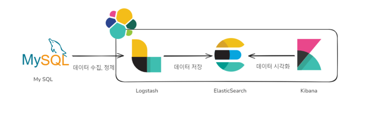

# WooriFISA Week3 미니프로젝트 : ELK Stack 구축을 통한 Titanic 데이터 시각화

[시각화 대시보드](http://127.0.0.1:5500/visual.html)

<br/>

<details>
  <summary>목차</summary>  
  
  - [수행 과제](#notebook-수행-과제)
  - [팀원](#raising_hand-팀원)
  - [실습환경](#실습환경)
  - [MySQL + ELK](#floppy_disk-mysql--elk)
  - [시각화](#bar_chart-시각화)
  - [트러블슈팅](#hammer-트러블슈팅)
  - [회고](#thought_balloon-회고)
      
</details>

## :notebook: 수행 과제
- MySQL + ELK 연동
- Titanic 데이터 분석 및 시각화

<br/>

## :raising_hand: 팀원
|||||
|:---:|:---:|:---:|:---:|
|[이승준](https://github.com/leesj000603)|[이현빈](https://github.com/been980804)|[조성현](https://github.com/cshharry)|[허예은](https://github.com/yyyeun)|

<br/>

## 실습환경
:penguin: **Ubuntu server 22.04.4 LTS**
:dolphin: **MySQL 8.0.37** 
:book: **ELK Stack 7.11.1**



## :floppy_disk: MySQL + ELK
### MySQL DB-Connector 설치
```bash
# 다운로드
$ wget 'https://dev.mysql.com/get/Downloads/Connector-J/mysql-connector-java-8.0.18.tar.gz'

# 압축 해제
$ tar -xvf ./mysql-connector-java-8.0.18.tar.gz

# logstash bin 디렉터리로 jar 파일 이전
$ sudo cp ./mysql-connector-java-8.0.18/mysql-connector-java-8.0.18.jar /usr/share/logstash/bin

# 압축 해제한 디렉터리 삭제
$ rm -rf ./mysql-connector-java-8.0.18*
```

### Logstash 설정
```bash
# logstash의 conf.d 디렉터리로 이동해 mysql_logstash config 파일 생성
$ cd /etc/logstash/conf.d
$ sudo touch mysql_logstash.conf
```

```bash
input {
  jdbc {
    jdbc_driver_library => "/usr/share/logstash/bin/mysql-connector-java-8.0.18.jar"
    jdbc_driver_class => "com.mysql.cj.jdbc.Driver"
    jdbc_connection_string => "jdbc:mysql://localhost:3306/(DB명)?serverTimezone=Asia/Seoul"
    jdbc_user => "(유저)"
    jdbc_password => "(패스워드)"
    statement => "select * from (Table명)"
  }
}

output {
  elasticsearch {
    hosts => ["http://localhost:9200"]
    index => "(index명)"
  }
}
```

### Logstash 실행
```bash
$ sudo /usr/share/logstash/bin/logstash -f /etc/logstash/conf.d/mysql_logstash.conf
```

<br/>

## :bar_chart: 시각화
<p align="center">
  
</p>

[시각화 아이디어 회의록](https://flower-polyanthus-3b1.notion.site/2024-07-25-be9bf47d5ae64f7885795db54d581d04?pvs=4)

<br/>

## :hammer: 트러블슈팅
### Kibana 대시보드 공유
- VirtualBox 네트워크 포트포워딩 수정 : localhost를 호스트 OS의 IP로 지정

<hr/>
### JDBC_driver 읽기 권한
```
Error: unable to load /home/username/lib/mysql-connector-java-8.0.18.jar from :jdbc_driver_library, 
file not readable (please check user and group permissions for the path)
```

logstash가 mysql-connector를 읽지 못하는 에러

#### 해결
1) 모든 유저에대한 읽기 권한 부여
```
chmod 644 /home/username/lib/mysql-connector-java-8.0.18.jar
```
또는

2) 파일 소유권 변경
logstash라는 소유자와 그룹에게 해당 파일에 대한 소유권 부여
```
sudo chown logstash:logstash /home/username/lib/mysql-connector-java-8.0.18.jar
```

<hr/>

### Timezone error

```
Error: Java::JavaSql::SQLException: The server time zone value 'KST' is unrecognized or represents more than one time zone. You must configure either the server or JDBC driver (via the serverTimezone configuration property) to use a more specifc time zone value if you want to utilize time zone support.
```
MySQL 서버에서 설정된 시간대가 JDBC 드라이버에서 인식되지 않는 문제

#### 해결

logstash conf 파일의 jdbc_connection_string 설정에 serverTimezone 설정 추가
```
jdbc_connection_string = "jdbc:mysql://[ip]:[port]/[데이터베이스명]?serverTimezone=Asia/Seoul";
```

<hr/>

### conf 파일의 filter 충돌

serverTimezone 설정 후 Elasticsearch에 index가 생성됐으나,전혀 관계 없는 컬럼이 생성됨

sudo systemctl enable logstash 설정으로 인해 자동 실행될 때 conf 파일을 읽어들이는 과정에서 conf 파일의 filter끼리 충돌하는 문제

#### 해결
1. logstash 자동 시작 해제 및 conf 파일 지정하여 logstash 가동

자동시작 해제
```
sudo systemctl disable logstash
```

conf 파일을 지정해서 실행
```
sudo /usr/share/logstash/bin/logstash -f /path/to/your/logstash.conf
```

또는

2. logstash.yml 의 path.config 속성 지정
```
path.config : /etc/logstash/single_conf
```


또는

3. pipelines.yml 설정

 logstash 6점대 버전 이상부터 제공하는 pipelines.yml을 통해 파이프라인을 분리하고 각 파이프라인에 사용할 conf 파일을 지정

 ```
 - pipeline.id: pipeline1
  path.config: "/etc/logstash/conf.d/pipeline1.conf"
- pipeline.id: pipeline2
  path.config: "/etc/logstash/conf.d/pipeline2.conf"
```


<br/>

## :thought_balloon: 회고
### 허예은
> 파이프라인을 직접 구축하는 과정을 통해 ELK Stack과 JDBC Driver에 대해 더 잘 이해할 수 있었습니다. 그리고 titanic 데이터를 시각화하면서 Kibana 사용법을 복습할 수 있어 좋았습니다.
<br/>

### 조성현
> Mysql과 ELK를 연동하는 과정에서 conf파일의 경로설정으로 이슈가 있었지만
팀원들과의 협업으로 성공적으로 연동 후 유의미한 결과를 보여주고 싶어
긴 회의를 거친 끝에 만족할 만한 결과를 만들어낸거 같아 뿌듯했습니다.
<br/>

### 이현빈
> 데이터를 정제해서 시각화 하는 과정에 있어 어떤 데이터를 추려 정제를 해 시각화를 할 수 있을까
아이디어를 내는 과정이 생각보다 힘들었습니다. 시작과정에서 환경세팅 부분에서 elasticsearch
디스크 용량 부족 문제로 어려웠지만 팀원들과의 소통으로 잘 해결해서 다행이라고 생각합니다.
<br/>

### 이승준
> mysql + elkstack의 파이프 라인을 구축하면서 여러 문제들이 발생했으나 해결하는 과정에서 얻은 점이 많았던 것 같습니다. 
트러블 슈팅 과정을 정리하면서 오래 기억에 남을 것 같고,
또한 팀원들과 시각화 주제에 대해 생각해보고 이야기를 나누며 결과물을 내는 과정이 즐거웠습니다.
<br/>
